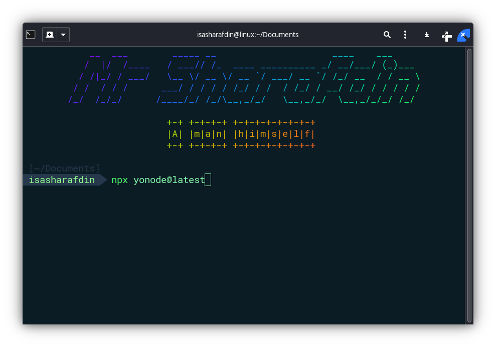
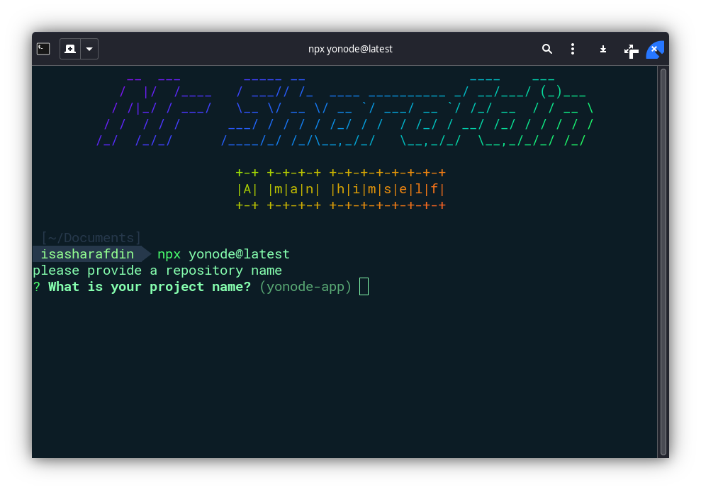
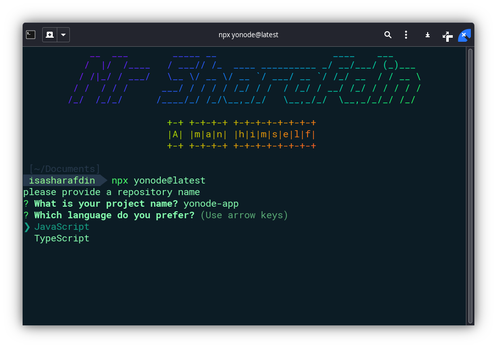
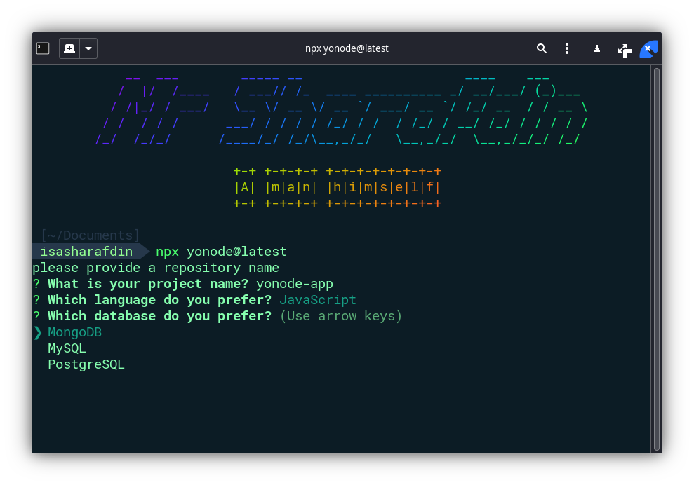
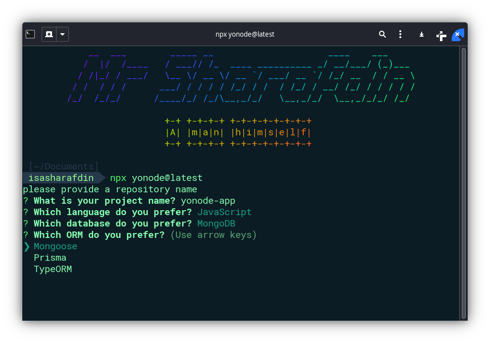
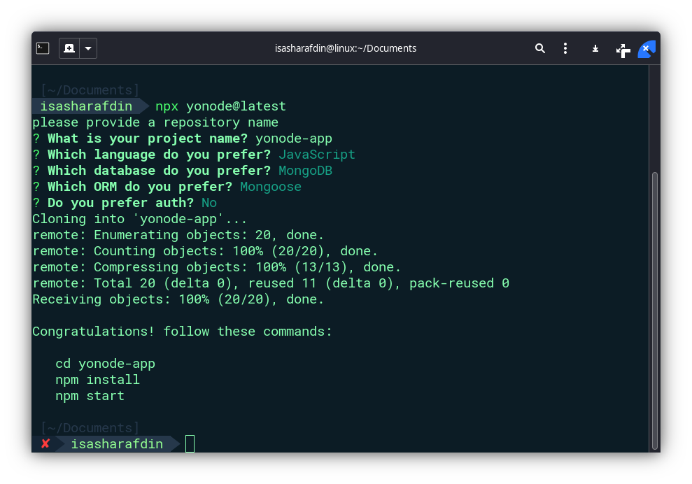

## Overview

Yonode templates, as part of a Node.js toolkit designed for rapid backend development, cater to developers working in both JavaScript and TypeScript environments. These templates streamline the initial setup and configuration process, allowing developers to focus more on crafting unique functionalities for their applications. The support for both JavaScript and TypeScript ensures that Yonode is accessible to a broad range of developers, accommodating different coding preferences and project requirements.

## Key Features

**Dual-Language Support**

JavaScript and TypeScript: Yonode templates are available for both JavaScript and TypeScript, offering flexibility in choosing the language that best suits your project's needs or your personal preference. This dual-language support ensures that the benefits of Yonode, such as rapid development and adherence to best practices, are accessible to a wider developer community.

**MVC Folder Structure**

A pre-organized directory layout that follows the Model-View-Controller (MVC) architecture, designed to maintain clean code separation and enhance project scalability. This facilitates an organized development process for both current JavaScript projects and TypeScript projects.

**Database Configurations**

Templates come with pre-configured database setups, including examples or configurations for connecting to various types of databases (SQL, NoSQL) and possibly integrating Object-Relational Mapping (ORM) tools. These setups facilitate database interactions using object-oriented programming.

**Authentication Flows**

Yonode provides templates specifically designed for implementing secure authentication mechanisms, such as login, and registration.

**Middleware Integrations**

Includes common middleware setups for tasks like logging, error handling, request body parsing, and session management. These are crucial for request preprocessing, security enhancements, and extending functionality.

**Environment Setup**

Examples for managing environment variables and application configurations are provided, essential for defining variable settings across different environments without hard-coding sensitive information into the application code.

## Yonode Templates

### Overview

Yonode templates, based on your previous descriptions and the context provided, refer to a set of predefined project structures or boilerplate provided by Yonode, a Node.js toolkit designed for rapid backend development. These templates are crafted to help developers kickstart their applications by reducing the initial setup and configuration time, enabling them to focus more on developing the unique functionalities of their applications. Here’s a breakdown of what Yonode templates might include, especially focusing on their role in streamlining backend development:

### JavaScript

The templates that support for **noAuth**:

| Database   | ORMs                                                         |
| ---------- | ------------------------------------------------------------ |
| MongoDB    | [Mongoose](mongoose), [Prisma](prisma), [TypeORM](typeorm)   |
| MySQL      | [Prisma](prisma), [Sequelize](sequelize), [TypeORM](typeorm) |
| PostgreSQL | [Prisma](prisma), [Sequelize](sequelize), [TypeORM](typeorm) |

The templates that support for **Auth**:

| Database       | ORMs                                                         |
| -------------- | ------------------------------------------------------------ |
| MongoDBAuth    | [Mongoose](mongoose), [Prisma](prisma), [TypeORM](typeorm)   |
| MySQLAuth      | [Prisma](prisma), [Sequelize](sequelize), [TypeORM](typeorm) |
| PostgreSQLAuth | [Prisma](prisma), [Sequelize](sequelize), [TypeORM](typeorm) |

### TypeScript

**TypeScript Support**: **Coming Soon in v1.5.0** - TypeScript support is not currently available, but it is a highly anticipated feature that will be included in Yonode version 1.5.0. This upcoming feature aims to provide developers with the benefits of type safety and the enhanced development experience that TypeScript offers.

## Your First Yonode Project

```bash copy
npx yonode@latest
```

Then follow the prompts!

You can streamline your project setup with Yonode by specifying the project name directly in the command line. Additionally, you have the flexibility to create your project in the current directory by using a `.` (dot) as the project name. Here’s how you can do it:

```bash
# To create a new Yonode project with a specific name:
npx yonode@latest yonode-app

# To create a new Yonode project in the current directory (the directory must be empty):
npx yonode@latest .
```

### Step 1: Start the Installation

In your terminal, begin the installation process by running the command `npx yonode@latest`. This command will fetch the latest version of Yonode and initiate the setup process.



### Step 2: Name Your Project

You'll be prompted to provide a name for your project. Enter your desired project name, or use `.` to create the project in the current directory; in this guide, we'll use `yonode-app` as an example."



### Step 3: Select Your Language Preference

When asked which language you prefer, use the arrow keys to select `JavaScript`. This is our choice for the example.



### Step 4: Choose Your Database

Yonode supports various databases. In this example, we'll go with MongoDB, a popular choice for modern web applications:



### Step 5: Select an ORM

Yonode provides integration with several ORMs for smooth database interactions. Let's select Mongoose for this example, which is commonly used with MongoDB:



### Step 6: Authentication Setup

Decide if you want to include authentication in your project. For this example, we'll say no to authentication and type `n` when prompted: `Do you prefer auth? (Y/n)`.

### Step 7: Installation Completion

After you've made all your selections, Yonode will configure your project. Once the process is finished, you'll see a congratulatory message. To get your application started, follow these commands:



Before launching your project, ensure you've properly configured your `.env` file. For guidance, you can refer to the examples provided here: [.env.example](https://github.com/sharafdin/yonode/blob/main/examples/.env.example). This step is crucial for setting up your project's environment variables correctly.

### Step 8: Verify Your Installation

To ensure everything is set up correctly, run `npm start` within your project directory. If your application launches without any errors, congratulations — your Yonode installation is successful, and you're ready to start building!
